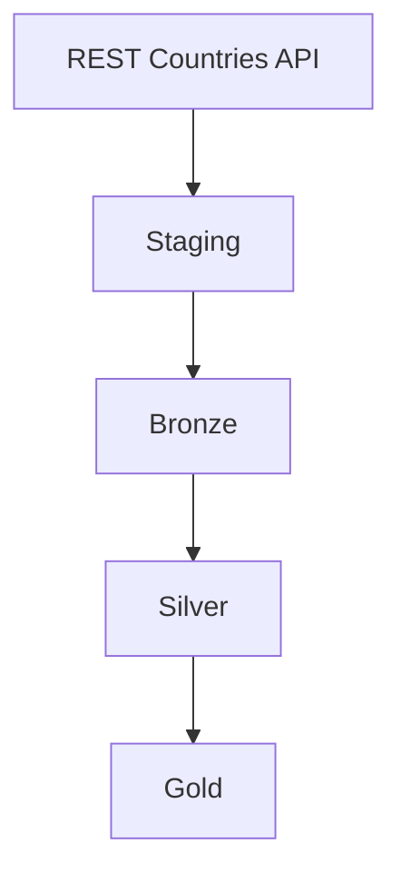

# REST Countries Data Pipeline

A Python data pipeline that retrieves country data from the REST Countries API,
processes it through a medallion-inspired architecture, and produces analytics-ready
Parquet output. The project demonstrates data engineering practices together with
automated testing, continuous integration, secret scanning, and scheduled execution
in GitHub Actions.

## Pipeline architecture



| Stage | Responsibility |
| --- | --- |
| **Staging** | Fetches paginated country data using Bearer authentication. Retries transient failures and rejects empty, incomplete, or invalid API responses. |
| **Bronze** | Stores each source record as raw JSON together with ingestion metadata in Parquet. A batch hash prevents an unchanged source batch from being appended twice. |
| **Silver** | Parses the latest Bronze batch against an explicit Polars schema and produces clean, typed country records. Missing values are handled consistently and invalid names are removed. |
| **Gold** | Produces total country and population metrics, plus country counts by region, continent, and currency. The final metrics are written to Parquet. |

The stages are orchestrated by `src/pipeline.py`:

```text
fetch_countries()
    -> to_rows() / land_raw()
    -> latest_batch()
    -> transform_all()
    -> summarize()
```

## Output

Running the pipeline creates the `data/` directory when needed and writes:

| File | Contents |
| --- | --- |
| `data/countries_bronze.parquet` | Raw source records with ingestion timestamp, source system, batch hash, and record order. |
| `data/gold_summary.parquet` | Aggregated metrics using the columns `metric`, `category`, and `value`. |

Silver data is transformed in memory and passed directly to Gold.

## Project structure

```text
.
|-- .github/workflows/   # CI and scheduled pipeline workflows
|-- data/                # Generated Parquet files
|-- src/
|   |-- staging.py       # API ingestion
|   |-- bronze.py        # Raw storage and batch handling
|   |-- silver.py        # Cleaning and typed transformations
|   |-- gold.py          # Aggregations and Gold output
|   `-- pipeline.py      # End-to-end orchestration
|-- tests/               # Unit tests and end-to-end integration test
|-- scripts/             # Post-deploy smoke check for the scheduled pipeline
|-- .env.example         # Environment variable template
|-- requirements.txt     # Runtime dependencies
|-- requirements-dev.txt # Development and quality tools
`-- CONTRIBUTING.md      # Contribution workflow and conventions
```

## Requirements

- Python 3.13
- Git
- A REST Countries API key

The API key is available through the free Academic plan from REST Countries.

## Local setup

Clone the repository and enter the project directory:

```bash
git clone https://github.com/NilssonAxel/devops_assignment1_grupp4.git
cd devops_assignment1_grupp4
```

Create a virtual environment:

```bash
python -m venv .venv
```

Activate it on Windows with Git Bash:

```bash
source .venv/Scripts/activate
```

Activate it on macOS or Linux:

```bash
source .venv/bin/activate
```

Install the development dependencies:

```bash
python -m pip install --upgrade pip
python -m pip install -r requirements-dev.txt
```

For a runtime-only installation, use `requirements.txt` instead.

## Environment variables

Create a local `.env` file from the provided template:

```bash
cp .env.example .env
```

Set the following values:

```dotenv
API_BASE_URL=https://api.restcountries.com/countries/v5
API_KEY=your-secret-key-here
```

| Variable | Required | Description |
| --- | --- | --- |
| `API_BASE_URL` | No | REST Countries v5 endpoint. The application uses the URL above as its default. |
| `API_KEY` | Yes | API key sent to the source as a Bearer token. |

Never commit `.env` or a real API key. The local `.env` file is excluded by
`.gitignore`, while GitHub Actions reads `API_KEY` from a repository secret.

## Run the pipeline

With the virtual environment active and `.env` configured, run:

```bash
python -m src.pipeline
```

On success, the command prints the path to `data/gold_summary.parquet`.

## Tests and code quality

Run the complete test suite:

```bash
python -m pytest
```

The suite contains unit tests for the individual pipeline stages and an integration
test that runs the full `staging -> bronze -> silver -> gold` chain without
contacting the live API.

Run the same linting and formatting checks used by CI:

```bash
python -m ruff check .
python -m ruff format --check .
```

To automatically format the project, run:

```bash
python -m ruff format .
```

See [CONTRIBUTING.md](CONTRIBUTING.md) for the branching, pull request, and
pre-commit workflow.

## Automation

### Continuous integration

The `ci` workflow runs for pull requests into `main` and pushes to `main`. It:

1. scans the repository for committed secrets with TruffleHog;
2. installs the development dependencies;
3. checks linting with Ruff;
4. checks formatting with Ruff; and
5. runs the test suite with pytest.

### Scheduled pipeline

The `pipeline` workflow runs every day at **06:17 UTC** and can also be started
manually from the GitHub Actions tab. It executes the live pipeline using the
repository's `API_KEY` secret.

After the pipeline runs, `scripts/smoke_check.py` checks the real
`data/gold_summary.parquet` it produced: that the file exists, has rows, has the
expected columns, and reports a positive country count. This is separate from
`tests/test_integration.py` — it runs against the live output of a real
deployment rather than stubbed data, and only checks that the result looks
plausible rather than asserting exact values. The check fails the workflow run
if it fails, so a source that has changed shape or gone away is caught here
rather than going unnoticed in a merged artifact.

Each run then uploads the generated `data/` directory as an artifact named
`pipeline-output`. Artifacts are retained for seven days. Uploading uses an
`always()` condition so that any available intermediate output, such as Bronze data,
is preserved even when a stage or the smoke check fails.

## Development note: resolved merge conflict

During [PR #23](https://github.com/NilssonAxel/devops_assignment1_grupp4/pull/23),
the Gold refactor and concurrent Silver/pipeline work both changed
`src/pipeline.py`. The conflict was resolved in
[commit `400a3ee`](https://github.com/NilssonAxel/devops_assignment1_grupp4/commit/400a3ee8c7aa5cec00f3d373acb8863eaffd9ea5)
by preserving the Bronze conversion with `to_rows()`, reading the latest Bronze
batch, passing it through Silver's `transform_all()`, and finally sending the
cleaned Polars DataFrame to Gold's `summarize()`.

Because the project uses squash merges, this intermediate merge commit is not
visible in the linear `main` branch history. The original conflict resolution is
retained in PR #23 and the linked commit for the project presentation.
